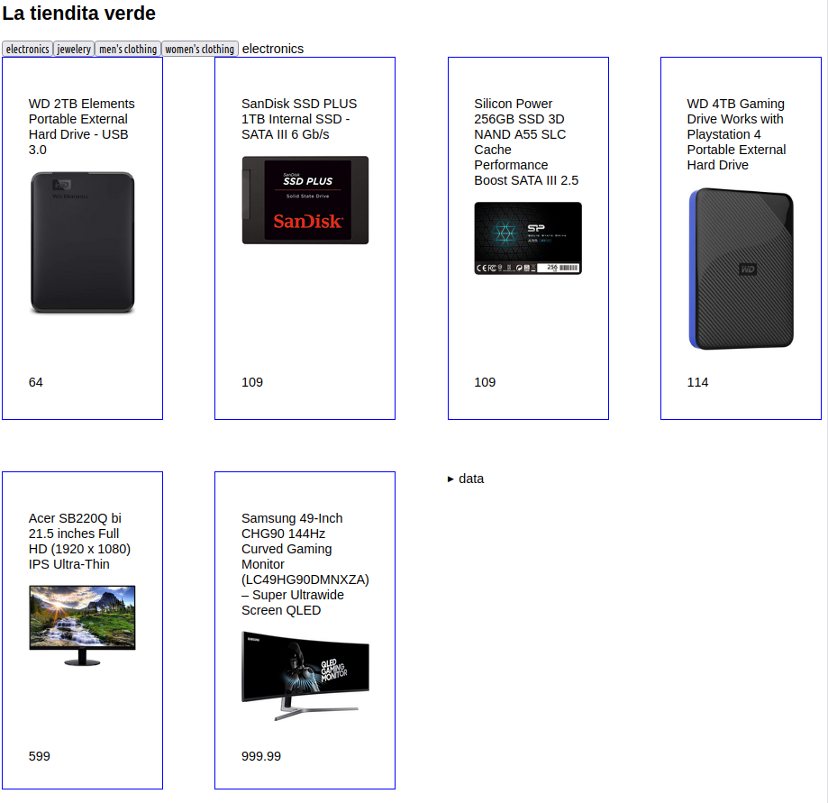

# La tiendita verde

Trabajar con datos en formato JSON desde una API externa

# Reto

Mostrar los elementos de la tienda de forma ordenada y por categoría:

- Botones para las categorías de productos: Al pulsar un botón se muestra la categoría seleccionada y los productos de dicha categoría.
- Utilizar solo `methods` y `data` (no usar `computed`)
- Aspecto visual parecido al que se muestra

